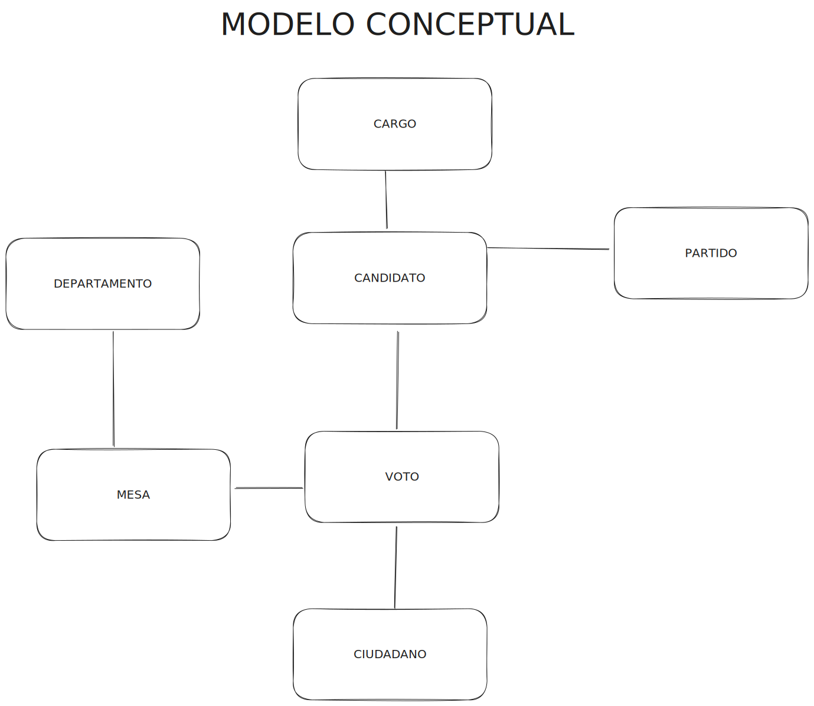
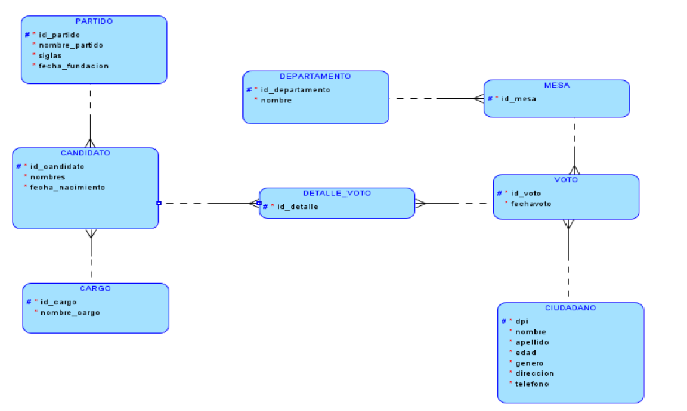

# Universidad de San Carlos de Guatemala

## Facultad de Ingeniería

## Escuela de Ciencias y Sistemas

## Sistema de Bases de Datos 1

## 202112145

## Daniel Estuardo Cuque Ruíz

## Introducción

El siguiente documento, tiene como objetivo explicar el modelo de la base de datos utilizada para el proyecto no. 1 de la materia de Sistemas de Bases de Datos 1, en el ciclo 2-2023.

## Modelo de la base de datos

### Modelo conceptual

### Modelo lógico

### Modelo relacional

## Tabla "PARTIDO"

La tabla "PARTIDO" almacena información relacionada con los partidos políticos. Los campos de esta tabla son:

- **id_partido**: Un identificador único para cada partido político.
- **nombre_partido**: El nombre completo del partido político.
- **siglas**: Las siglas o acrónimo del partido político.
- **fecha_fundacion**: La fecha de fundación del partido político.

## Tabla "CANDIDATO"

La tabla "CANDIDATO" se utiliza para registrar información sobre los candidatos políticos. Sus campos incluyen:

- **id_candidato**: Un identificador único para cada candidato.
- **nombre_candidato**: El nombre completo del candidato.
- **fecha_nacimiento**: La fecha de nacimiento del candidato.
- **id_partido**: Una clave externa que se relaciona con la tabla "PARTIDO" y representa a qué partido pertenece el candidato.
- **id_cargo**: Una clave externa que se relaciona con la tabla "CARGO" y especifica el cargo al que se postula el candidato.

## Tabla "CARGO"

La tabla "CARGO" almacena los tipos de cargos políticos disponibles. Sus campos son:

- **id_cargo**: Un identificador único para cada tipo de cargo.
- **nombre_cargo**: El nombre del cargo político.

## Tabla "DEPARTAMENTO"

La tabla "DEPARTAMENTO" contiene información sobre los departamentos geográficos. Los campos de esta tabla son:

- **id_departamento**: Un identificador único para cada departamento.
- **nombre_departamento**: El nombre del departamento geográfico.

## Tabla "MESA"

La tabla "MESA" se utiliza para registrar mesas de votación. Sus campos incluyen:

- **id_mesa**: Un identificador único para cada mesa de votación.
- **id_departamento**: Una clave externa que se relaciona con la tabla "DEPARTAMENTO" y especifica a qué departamento geográfico pertenece la mesa.

## Tabla "CIUDADANO"

La tabla "CIUDADANO" almacena información sobre los ciudadanos. Sus campos son:

- **dpi**: El Documento Personal de Identificación (DPI) del ciudadano, que actúa como clave primaria.
- **nombre**: El nombre completo del ciudadano.
- **apellido**: El apellido completo del ciudadano.
- **direccion**: La dirección de residencia del ciudadano.
- **telefono**: El número de teléfono del ciudadano.
- **edad**: La edad del ciudadano.
- **genero**: El género del ciudadano (por ejemplo, "M" para masculino o "F" para femenino).

## Tabla "VOTO"

La tabla "VOTO" se utiliza para registrar votos emitidos por los ciudadanos. Sus campos son:

- **id_voto**: Un identificador único para cada voto.
- **dpi**: Una clave externa que se relaciona con la tabla "CIUDADANO" y representa el DPI del votante.
- **id_mesa**: Una clave externa que se relaciona con la tabla "MESA" y especifica la mesa de votación en la que se emitió el voto.
- **fecha_voto**: La fecha y hora en que se emitió el voto.

## Tabla "DETALLE_VOTO"

La tabla "DETALLE_VOTO" almacena detalles específicos de cada voto, como los candidatos seleccionados en cada voto. Sus campos son:

- **id_voto**: Una clave externa que se relaciona con la tabla "VOTO" y especifica a qué voto corresponde el detalle.
- **id_candidato**: Una clave externa que se relaciona con la tabla "CANDIDATO" y representa al candidato seleccionado en el voto.
- **id_detalle**: Un identificador único y autoincremental que actúa como clave primaria para cada detalle de voto.

Este script SQL proporciona la estructura fundamental para una base de datos relacionada con elecciones y candidatos políticos, con tablas que representan información clave en el proceso electoral.